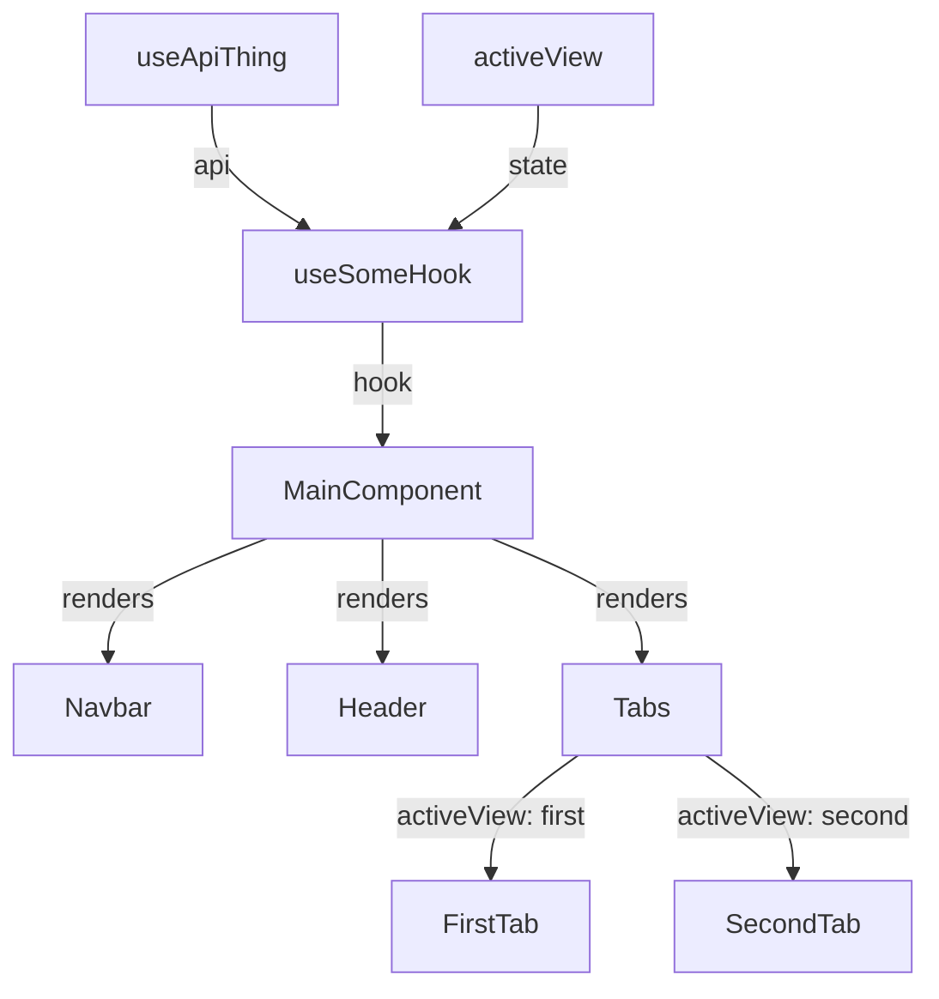

# Component Mermaid Flowchart

## Overview

Create a small `flowchart TD` diagram that helps a developer understand what a component imports, calls, and renders. Prefer clarity over completeness.

## Workflow

1. Read the target component first.
2. Read only directly imported local components, hooks, and API helpers needed to name the main relationships.
3. Identify:
   - Hooks used by the component
   - State or values returned by hooks
   - API/data hooks called indirectly by custom hooks
   - Components rendered by the target component
   - Conditional branches only when they explain important render paths
4. Produce one compact Mermaid code block.

## Diagram Style

- Use `flowchart TD`.
- Keep node names close to code names: `ProjectManagePage`, `useProjectManage`, `BasicInfoTab`.
- Use short edge labels: `hook`, `api`, `state`, `renders`, `branch`.
- Avoid including DOM details like `div`, `button`, `input`, unless the user asks for a UI element breakdown.
- Avoid deep internals of child components unless the child component is central to the user's question.
- Show tab or route branches only if they clarify why different children appear.
- Prefer 6-12 nodes for a simple explanation.
- Do not over-model every import, icon, type, CSS class, or utility.

## Template

## Response Shape

When the user asks only for the chart, return just the Mermaid block plus at most one short sentence. When useful, mention that the chart is intentionally simplified and omits low-level DOM nodes.
