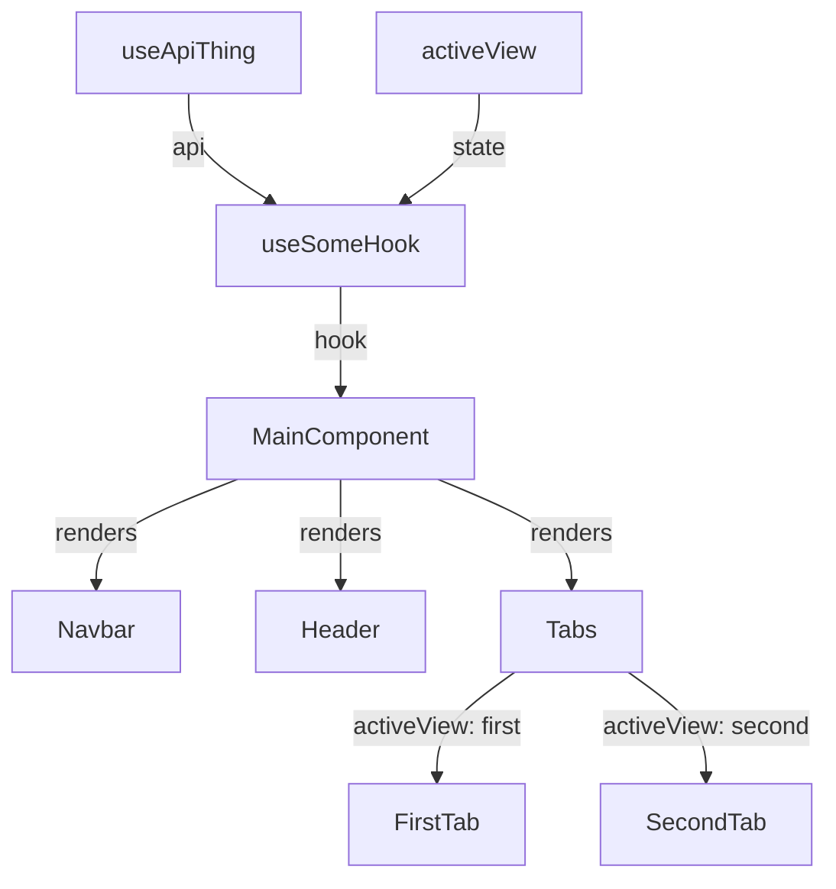
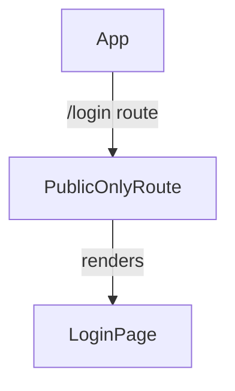

# Component Mermaid Flowchart

## Overview

Create a small `flowchart TD` diagram that helps a developer understand what a component imports, calls, and renders. Prefer clarity over completeness.

## Workflow

1. Read the target component first.
2. Read only directly imported local components, hooks, and API helpers needed to name the main relationships.
3. Identify:
   - Hooks used by the component
   - State or values returned by hooks
   - API/data hooks called indirectly by custom hooks
   - Components rendered by the target component
   - Conditional branches only when they explain important render paths
4. Choose the output format from the user's requested filename or context:
   - For `.mmd`, write raw Mermaid syntax without Markdown fences or prose.
   - For `.md`, embed the diagram in a fenced `mermaid` block and add a concise explanation.
   - When no file format is requested, return a fenced `mermaid` block in the response.
5. Produce one compact diagram unless the user asks for multiple views.

## Diagram Style

- Use `flowchart TD`.
- Keep node names close to code names: `ProjectManagePage`, `useProjectManage`, `BasicInfoTab`.
- Use short edge labels: `hook`, `api`, `state`, `renders`, `branch`.
- Avoid including DOM details like `div`, `button`, `input`, unless the user asks for a UI element breakdown.
- Avoid deep internals of child components unless the child component is central to the user's question.
- Show tab or route branches only if they clarify why different children appear.
- Prefer 6-12 nodes for a simple explanation.
- Do not over-model every import, icon, type, CSS class, or utility.

## Template



## File Formats

For a standalone Mermaid file such as `auth-feature-flow.mmd`, use only valid Mermaid source:

```text
flowchart TD
  App -- /login route --> PublicOnlyRoute
  PublicOnlyRoute -- renders --> LoginPage
```

For a Markdown document, provide enough context for the diagram to stand on its own:

````markdown
# Authentication Feature Flow

This diagram shows how the login route renders the form and how a successful login updates authentication state.



## Explanation

`PublicOnlyRoute` exposes `LoginPage` only to unauthenticated users. The login form then calls the authentication API and stores the authenticated session after success.
````

Keep the explanation short and focused on the important render, state, hook, and API relationships. Do not merely restate every edge.

## Response Shape

When the user asks only for the chart, return just the Mermaid block plus at most one short sentence. When creating a `.mmd` file, place only raw Mermaid syntax in it. When creating a `.md` file, include a descriptive heading, the fenced Mermaid block, and a concise explanation. When useful, mention that the chart is intentionally simplified and omits low-level DOM nodes.
