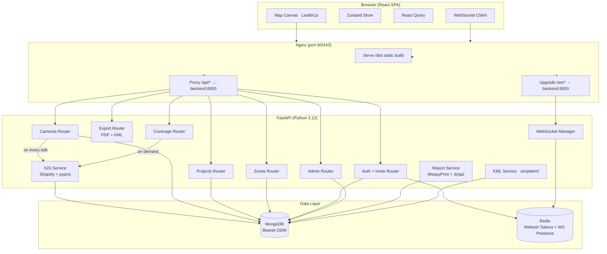

# SPEC.md — CCTV Survey Planner

**Version:** 1.0  
**Date:** March 2026  
**Status:** Approved for Implementation

---

## 1. Project Overview

The CCTV Survey Planner is a web-based, multi-user GIS application for security consultants, surveyors, and facility managers to plan and validate CCTV camera deployments on a 2D map before physical installation.

Users place cameras on a map, configure field-of-view (FOV) parameters, draw coverage zones and perimeters, and generate PDF reports and KML exports. The core value proposition is visual confirmation of total coverage — identifying blind spots, overlaps, and perimeter gaps prior to installation.

**Primary stakeholders:** Security consultants, facility managers, survey teams.  
**Access model:** Invite-only. Admin users create accounts; no open self-registration.

---

## 2. Goals & Success Criteria

| Goal | Success Criterion |
|---|---|
| Visual FOV planning | User can place a camera and see its FOV polygon render on the map within 500ms of stopping an edit |
| Multi-user collaboration | Two editors in the same project see each other's changes within 2 seconds via WebSocket |
| Coverage analysis | "Recalculate Coverage" returns total covered area (m²), overlap zones, and uncovered sub-regions as map overlays |
| Report generation | PDF report generated and downloaded within 10 seconds, containing map screenshot, camera table, and coverage summary |
| KML export | KML file exports correctly and opens in Google Earth with camera placemarks and FOV polygons |
| Access control | Viewer-role users receive HTTP 403 on any mutating operation; enforced server-side |

---

## 3. Scope

### In Scope

- Invite-only user authentication with JWT
- Admin user management (invite token generation, role assignment)
- Camera model library (per-user, private)
- Project creation, management, and collaborator invitations
- 2D map-based camera placement, drag-to-move, bearing rotation
- Real-time FOV polygon computation (debounced, on every camera edit)
- On-demand coverage analysis (union of FOVs, gap detection, overlap highlighting)
- Zone/perimeter drawing tools (polygon and polyline)
- Auto-save and manual save
- Real-time multi-user collaboration via WebSocket
- Role-based access control (Owner / Editor / Viewer)
- PDF report generation (server-side, client-supplied map image)
- KML export
- Docker Compose deployment (provider-agnostic)

### Out of Scope

- Open self-registration
- 3D / height-aware FOV calculations (all coverage is flat 2D projection)
- Video feed integration or live camera connectivity
- AI-based camera placement optimisation
- Mobile-native app (responsive web only)
- Offline / PWA mode
- Undo/redo history
- Shared global camera model library
- SMTP email delivery (invite links are copy-paste, no email sending required)

---

## 4. Architecture

### 4.1 Architecture Diagram



### 4.2 Component Descriptions

---

**Nginx**
- **Responsibility:** Reverse proxy and static asset server. Terminates HTTP, serves the compiled React build from `/dist`, proxies `/api/*` to FastAPI, and upgrades `/ws/*` connections to WebSocket.
- **Technology:** Nginx (Alpine Docker image)
- **Interfaces:** Ingress on port 80 (443 if TLS terminated here). Upstream: `backend:8000`.

---

**React Frontend**
- **Responsibility:** Single-page application. Renders the map canvas, toolbar, left panel, and camera/zone editing UI. Manages all client-side state.
- **Technology:** React 18 + Vite, Leaflet.js, Leaflet.draw, Zustand, React Query, Axios, Tailwind CSS
- **Interfaces:**
  - REST calls to `/api/v1/*` via Axios + React Query
  - WebSocket connection to `/ws/projects/{id}`
  - Emits map canvas as base64 PNG for report generation

**Zustand store slices:**
- `authSlice` — current user, JWT access token
- `projectSlice` — active project metadata, collaborators
- `cameraSlice` — camera instances array, selected camera ID
- `zoneSlice` — zone array, selected zone ID
- `mapSlice` — active tool, layer visibility toggles, map bounds
- `coverageSlice` — latest coverage stats result, last computed timestamp

---

**FastAPI Backend**
- **Responsibility:** Stateless REST API and WebSocket server. Handles auth, all CRUD operations, GIS computation delegation, PDF/KML generation.
- **Technology:** Python 3.12, FastAPI, Uvicorn, Beanie (ODM), python-jose (JWT), passlib (bcrypt)
- **Interfaces:** HTTP/1.1 REST on port 8000; WebSocket on same port at `/ws/*`

---

**GIS Service** *(internal Python module, no HTTP boundary)*
- **Responsibility:** All geometry computation. FOV polygon generation (4-point approximation), geodesic distance/bearing calculations, coverage union and intersection analysis.
- **Technology:** Shapely 2.x, pyproj
- **Interfaces:**
  - `compute_fov_polygon(lat, lng, bearing, fov_angle, max_range, min_range) → GeoJSON Polygon`
  - `compute_coverage_stats(fov_polygons: list[Polygon], zone_polygons: list[Polygon]) → CoverageStats`

**FOV polygon algorithm (4-point):**
1. Origin: camera position `(lat, lng)`
2. Left vertex: geodesic point at `max_range` metres, bearing `bearing − fov_angle/2`
3. Arc midpoint: geodesic point at `max_range` metres, bearing `bearing` (centre)
4. Right vertex: geodesic point at `max_range` metres, bearing `bearing + fov_angle/2`

If `min_range > 0`: replace origin with two near-field points at `min_range` along each bounding bearing, forming a 5-point truncated polygon.

---

**WebSocket Manager** *(in-process, FastAPI)*
- **Responsibility:** Maintains a registry of active WebSocket connections keyed by `project_id`. Broadcasts mutation events to all connected clients in a project room except the originating connection.
- **Technology:** FastAPI WebSocket, Redis (for presence tracking only in V1 — pub/sub not required on single instance)
- **Interfaces:**
  - Inbound: connection at `/ws/projects/{id}?token={jwt}`
  - Outbound broadcast message types: `camera_updated`, `camera_added`, `camera_deleted`, `zone_updated`, `zone_added`, `zone_deleted`, `coverage_recalculated`, `user_joined`, `user_left`

---

**Report Service**
- **Responsibility:** Accepts a base64 map image from the client, fetches project data from MongoDB, renders a Jinja2 HTML template, and converts to PDF via WeasyPrint.
- **Technology:** WeasyPrint, Jinja2
- **Interfaces:** Called by `POST /api/v1/projects/{id}/report`. Streams PDF bytes back as `application/pdf`.

---

**KML Service**
- **Responsibility:** Fetches all cameras and zones for a project and generates a `.kml` file using simplekml. Camera positions as Placemarks, FOV polygons and zones as styled Polygon/LineString features.
- **Technology:** simplekml
- **Interfaces:** Called by `GET /api/v1/projects/{id}/export/kml`. Returns `application/vnd.google-earth.kml+xml`.

---

**MongoDB**
- **Responsibility:** Primary persistent store for all application data.
- **Technology:** MongoDB 7.x, Beanie async ODM
- **Collections:** `users`, `invite_tokens`, `camera_models`, `projects`, `camera_instances`, `zones`

---

**Redis**
- **Responsibility:** JWT refresh token store (with TTL) and WebSocket presence set (user IDs per project room).
- **Technology:** Redis 7.x
- **Key patterns:**
  - `refresh:{token_hash}` → `user_id` (TTL: 7 days)
  - `presence:{project_id}` → Set of `user_id` strings (TTL: refreshed on heartbeat)

---

## 5. Data Model

### 5.1 Entities

---

**User**
```
_id:            ObjectId        PK
email:          string          unique, indexed
password_hash:  string          bcrypt
display_name:   string
system_role:    enum            [admin, user]  — admin can manage users system-wide
created_at:     datetime
```
*Note: project-level roles (owner/editor/viewer) live on the Project document, not on User.*

---

**InviteToken**
```
_id:            ObjectId        PK
token_hash:     string          SHA-256 hash of the raw token; indexed unique
email:          string          intended recipient (informational only)
created_by:     ObjectId        → User (admin who generated it)
expires_at:     datetime        72 hours from creation
used_at:        datetime | null null until redeemed
created_at:     datetime
```
*Raw token is a cryptographically random 32-byte URL-safe string. Only the hash is stored. Admin receives the full URL: `https://{host}/accept-invite?token={raw}`.*

---

**CameraModel** *(per-user template library)*
```
_id:            ObjectId        PK
owner_id:       ObjectId        → User; indexed
name:           string          e.g. "Hikvision DS-2CD2143"
manufacturer:   string
fov_angle:      float           horizontal FOV in degrees (1–360)
max_range:      float           metres; > 0
min_range:      float           metres; >= 0 (0 = no blind spot)
aspect_ratio:   float | null    optional display hint
notes:          string
created_at:     datetime
```

---

**Project**
```
_id:            ObjectId        PK
name:           string
description:    string
owner_id:       ObjectId        → User; indexed
collaborators:  [
  {
    user_id:    ObjectId        → User
    role:       enum            [editor, viewer]
  }
]
base_map: {
  center_lat:   float
  center_lng:   float
  default_zoom: int             (1–22)
}
coverage_stats: {               — cached result of last recalculation
  total_covered_m2:   float
  overlap_geojson:    GeoJSON FeatureCollection | null
  gap_geojson:        GeoJSON FeatureCollection | null
  computed_at:        datetime | null
} | null
created_at:     datetime
updated_at:     datetime        — updated on any project mutation
```

---

**CameraInstance**
```
_id:              ObjectId      PK
project_id:       ObjectId      → Project; indexed
model_id:         ObjectId      → CameraModel
label:            string        e.g. "CAM-01"
position: {
  lat:            float
  lng:            float
}
bearing:          float         degrees from North (0–360)
fov_geojson:      GeoJSON Polygon  — pre-computed, updated on every edit
override_fov_angle: float | null   — null = use model default
override_range:   float | null     — null = use model default
override_min_range: float | null
is_fov_visible:   boolean
color:            string        hex colour e.g. "#3388ff"
created_at:       datetime
updated_at:       datetime
```

---

**Zone**
```
_id:          ObjectId          PK
project_id:   ObjectId          → Project; indexed
label:        string
type:         enum              [polygon, polyline]
geojson:      GeoJSON Geometry  Polygon or LineString
purpose:      enum              [coverage_area, perimeter, exclusion, note]
color:        string            hex colour
created_at:   datetime
updated_at:   datetime
```

### 5.2 Storage Strategy

- **Database:** MongoDB 7.x running in Docker container, data volume mounted at `./data/mongo`.
- **ODM:** Beanie (async Pydantic v2). All documents defined as Beanie `Document` subclasses with explicit index declarations.
- **Indexes:**
  - `users`: unique on `email`
  - `invite_tokens`: unique on `token_hash`
  - `camera_models`: on `owner_id`
  - `camera_instances`: on `project_id`
  - `zones`: on `project_id`
  - `projects`: on `owner_id`; sparse multikey on `collaborators.user_id`
- **Migrations:** No migration framework in V1. Schema changes handled by Beanie model updates with optional migration scripts in `packages/backend/migrations/`.
- **Backups:** Docker volume backup via host cron job (`mongodump`) to a mounted backup directory. Operator responsibility.

---

## 6. API & Integration Contracts

All REST endpoints prefixed `/api/v1`. All requests/responses in JSON unless noted. All protected endpoints require `Authorization: Bearer {access_token}` header.

### 6.1 Authentication & Invite

| Method | Endpoint | Auth | Description |
|---|---|---|---|
| POST | `/auth/login` | None | Email + password → access + refresh tokens |
| POST | `/auth/refresh` | None | Refresh token → new access token |
| POST | `/auth/logout` | Required | Invalidate refresh token in Redis |
| GET | `/auth/accept-invite` | None | Validate invite token, return token metadata |
| POST | `/auth/accept-invite` | None | Complete registration (set display_name + password) |

**POST `/auth/login`**
```json
Request:  { "email": "string", "password": "string" }
Response: { "access_token": "string", "refresh_token": "string", "token_type": "bearer" }
Errors:   401 invalid credentials
```

**POST `/auth/accept-invite`**
```json
Request:  { "token": "string", "display_name": "string", "password": "string" }
Response: { "access_token": "string", "refresh_token": "string", "token_type": "bearer" }
Errors:   400 token invalid or expired | 409 email already registered
```

### 6.2 Admin

| Method | Endpoint | Auth | Description |
|---|---|---|---|
| GET | `/admin/users` | Admin | List all users |
| POST | `/admin/invite` | Admin | Generate invite token |
| DELETE | `/admin/users/{user_id}` | Admin | Deactivate user |

**POST `/admin/invite`**
```json
Request:  { "email": "string" }
Response: { "invite_url": "string", "expires_at": "ISO8601 datetime" }
Errors:   403 not admin | 409 pending invite already exists for email
```

### 6.3 Camera Models

| Method | Endpoint | Auth | Description |
|---|---|---|---|
| GET | `/camera-models` | Required | List caller's camera models |
| POST | `/camera-models` | Required | Create model |
| GET | `/camera-models/{id}` | Required | Get single model |
| PUT | `/camera-models/{id}` | Required | Update model |
| DELETE | `/camera-models/{id}` | Required | Delete model |

**POST/PUT `/camera-models`**
```json
Request: {
  "name": "string",
  "manufacturer": "string",
  "fov_angle": "float (1–360)",
  "max_range": "float (>0)",
  "min_range": "float (>=0)",
  "aspect_ratio": "float | null",
  "notes": "string"
}
Response: CameraModel document
Errors: 404 not found | 403 not owner
```

### 6.4 Projects

| Method | Endpoint | Auth | Description |
|---|---|---|---|
| GET | `/projects` | Required | List projects where caller is owner or collaborator |
| POST | `/projects` | Required | Create project |
| GET | `/projects/{id}` | Required | Full project: metadata + cameras + zones |
| PUT | `/projects/{id}` | Owner/Editor | Update project metadata |
| DELETE | `/projects/{id}` | Owner | Delete project and all children |
| POST | `/projects/{id}/collaborators` | Owner | Add collaborator |
| DELETE | `/projects/{id}/collaborators/{user_id}` | Owner | Remove collaborator |

**GET `/projects/{id}`**
```json
Response: {
  "project": { ...Project fields... },
  "cameras": [ ...CameraInstance[] with fov_geojson... ],
  "zones": [ ...Zone[]... ]
}
```

**POST `/projects/{id}/collaborators`**
```json
Request:  { "user_id": "string", "role": "editor | viewer" }
Response: Updated collaborators array
Errors:   404 user not found | 409 already collaborator
```

### 6.5 Cameras

| Method | Endpoint | Auth | Description |
|---|---|---|---|
| POST | `/projects/{id}/cameras` | Owner/Editor | Place camera; computes FOV inline |
| PUT | `/projects/{id}/cameras/{cam_id}` | Owner/Editor | Update camera; recomputes FOV inline |
| DELETE | `/projects/{id}/cameras/{cam_id}` | Owner/Editor | Remove camera |

**POST/PUT camera request:**
```json
{
  "model_id": "ObjectId string",
  "label": "string",
  "position": { "lat": "float", "lng": "float" },
  "bearing": "float (0–360)",
  "override_fov_angle": "float | null",
  "override_range": "float | null",
  "override_min_range": "float | null",
  "is_fov_visible": "boolean",
  "color": "hex string"
}
```
**Response:** Full `CameraInstance` including computed `fov_geojson`.  
**Side effect:** WebSocket broadcast `camera_updated` / `camera_added` to project room.

### 6.6 Zones

| Method | Endpoint | Auth | Description |
|---|---|---|---|
| POST | `/projects/{id}/zones` | Owner/Editor | Create zone |
| PUT | `/projects/{id}/zones/{zone_id}` | Owner/Editor | Update zone |
| DELETE | `/projects/{id}/zones/{zone_id}` | Owner/Editor | Delete zone |

**POST/PUT zone request:**
```json
{
  "label": "string",
  "type": "polygon | polyline",
  "geojson": "GeoJSON Geometry object",
  "purpose": "coverage_area | perimeter | exclusion | note",
  "color": "hex string"
}
```
**Side effect:** WebSocket broadcast `zone_updated` / `zone_added` to project room.

### 6.7 Coverage Analysis

| Method | Endpoint | Auth | Description |
|---|---|---|---|
| POST | `/projects/{id}/coverage` | Owner/Editor | Run coverage analysis; stores result on project |

**Response:**
```json
{
  "total_covered_m2": "float",
  "overlap_geojson": "GeoJSON FeatureCollection | null",
  "gap_geojson": "GeoJSON FeatureCollection | null",
  "computed_at": "ISO8601 datetime"
}
```
**Side effect:** Stores result in `project.coverage_stats`. WebSocket broadcast `coverage_recalculated` with full stats to project room.

### 6.8 Export & Reports

| Method | Endpoint | Auth | Description |
|---|---|---|---|
| POST | `/projects/{id}/report` | Required (any role) | Generate PDF report |
| GET | `/projects/{id}/export/kml` | Required (any role) | Download KML file |

**POST `/projects/{id}/report` request:**
```json
{
  "map_image_base64": "string (PNG, base64-encoded)",
  "include_coverage_stats": "boolean"
}
```
**Response:** `application/pdf` stream, `Content-Disposition: attachment; filename="{project_name}_report.pdf"`

### 6.9 WebSocket

**Endpoint:** `WS /ws/projects/{id}?token={access_token}`

**Connection auth:** JWT validated on upgrade handshake. Invalid token → close with code 4001.

**Broadcast message envelope:**
```json
{
  "type": "camera_updated | camera_added | camera_deleted | zone_updated | zone_added | zone_deleted | coverage_recalculated | user_joined | user_left",
  "project_id": "string",
  "actor_user_id": "string",
  "payload": { ...type-specific data... }
}
```

**Client behaviour:** On receiving a broadcast, client merges payload into Zustand store and Leaflet re-renders affected layers. No REST refetch required for camera/zone events (payload contains full updated document).

---

## 7. Authentication & Authorisation

### Auth Mechanism

- **Access token:** JWT (HS256), signed with `JWT_SECRET` env var. TTL: 15 minutes. Contains `sub` (user_id), `system_role`, `exp`.
- **Refresh token:** Cryptographically random 32-byte string. Stored as SHA-256 hash in Redis with 7-day TTL. Rotated on each use.
- **Invite token:** Cryptographically random 32-byte URL-safe string. SHA-256 hash stored in MongoDB. TTL: 72 hours. Single-use (marked `used_at` on redemption).
- **WebSocket auth:** Access token passed as query parameter `?token=...` on the upgrade request. Validated server-side before connection is accepted.

### Roles & Permissions Matrix

| Action | Owner | Editor | Viewer |
|---|---|---|---|
| View project (read cameras, zones) | ✅ | ✅ | ✅ |
| Place / edit / delete camera | ✅ | ✅ | ❌ |
| Create / edit / delete zone | ✅ | ✅ | ❌ |
| Run coverage analysis | ✅ | ✅ | ❌ |
| Generate PDF report | ✅ | ✅ | ✅ |
| Export KML | ✅ | ✅ | ✅ |
| Edit project metadata | ✅ | ✅ | ❌ |
| Invite / remove collaborators | ✅ | ❌ | ❌ |
| Delete project | ✅ | ❌ | ❌ |
| Transfer ownership | ✅ | ❌ | ❌ |

**System roles:**
- `admin` — can access `/admin/*` routes (invite generation, user management)
- `user` — standard access, no admin routes

All permission checks are enforced server-side. The frontend hides disallowed UI elements as a UX courtesy only — the backend is the authoritative enforcement point.

---

## 8. Non-Functional Requirements

| Concern | Requirement | Approach |
|---|---|---|
| FOV render latency | FOV polygon visible within 500ms of user stopping a camera edit | 300ms debounce on frontend; GIS computation target <100ms server-side for single camera |
| Coverage analysis | Response within 5 seconds for projects with up to 50 cameras and 20 zones | Shapely operations are synchronous in FastAPI async endpoint via `run_in_executor`; acceptable at this scale |
| WebSocket broadcast | Change visible to other users within 2 seconds | In-process broadcast on same FastAPI instance; no queuing needed at V1 scale |
| API availability | Best-effort; no SLA for V1 | Single VM with Docker Compose restart policies (`unless-stopped`) |
| Security | Passwords bcrypt-hashed (cost factor 12). JWTs short-lived (15min). HTTPS enforced in production. No sensitive data in logs | passlib[bcrypt], HTTPS via host-level TLS or Nginx SSL termination |
| Input validation | All API inputs validated with Pydantic v2 models | FastAPI + Pydantic v2 with strict types and field constraints |
| Scalability | Support <50 concurrent users, <200 projects | Single-instance deployment sufficient; no horizontal scaling required in V1 |
| Browser support | Latest two versions of Chrome, Firefox, Safari, Edge | Vite build targets `es2020`; Leaflet.js is broadly compatible |

---

## 9. Infrastructure & Deployment

### Docker Compose Services

```yaml
services:
  nginx:       # Nginx Alpine; serves /dist, proxies /api and /ws
  backend:     # Python 3.12 slim; uvicorn on port 8000
  mongodb:     # MongoDB 7; volume: ./data/mongo
  redis:       # Redis 7 Alpine; volume: ./data/redis
```

All services on a shared internal Docker network (`cctv_net`). Only Nginx exposes an external port (80, optionally 443).

### Environments

| Environment | Description |
|---|---|
| `development` | Services run natively on the developer's machine — no Docker. See below. |
| `production` | `docker-compose.yml` — built React `/dist` served by Nginx, Uvicorn with 2 workers |

#### Development Environment (Native)

No Docker is used in development. Each service is run directly on the developer's machine:

| Service | How to run | Default port |
|---|---|---|
| MongoDB | Local install or MongoDB Atlas free tier (cloud) | 27017 |
| Redis | Local install or Redis Cloud free tier (cloud) | 6379 |
| FastAPI backend | `uvicorn app.main:app --reload` from `packages/backend` | 8000 |
| React frontend | `pnpm dev` from `packages/frontend` (Vite dev server) | 5173 |

Nginx is **not** used in development. The Vite dev server proxies `/api/*` and `/ws/*` to FastAPI directly via its built-in proxy config:

```ts
// packages/frontend/vite.config.ts
server: {
  proxy: {
    '/api': 'http://localhost:8000',
    '/ws': { target: 'ws://localhost:8000', ws: true }
  }
}
```

This replicates Nginx's routing behaviour exactly, so frontend code requires no changes between environments.

**Developer prerequisites:**
- Node.js ≥ 18 + pnpm
- Python 3.12 + pip
- MongoDB running locally or Atlas connection string
- Redis running locally or Redis Cloud connection string

A `.env.local` file in `packages/backend` overrides any production env vars for local development. This file is git-ignored.

### Environment Variables (`.env`)

```
# Backend
MONGO_URI=mongodb://mongodb:27017/cctv_planner
REDIS_URL=redis://redis:6379/0
JWT_SECRET=<random 64-char secret>
JWT_ACCESS_TTL_MINUTES=15
JWT_REFRESH_TTL_DAYS=7
INVITE_TOKEN_TTL_HOURS=72
FIRST_ADMIN_EMAIL=admin@example.com      # seeded on first startup
FIRST_ADMIN_PASSWORD=<set on first run>

# Frontend (Vite build-time)
VITE_API_BASE_URL=/api/v1
VITE_WS_BASE_URL=/ws
VITE_STADIA_MAPS_API_KEY=<key>
```

`.env.example` committed to repo with all keys and placeholder values. `.env` git-ignored.

### Monorepo Structure

```
/
├── packages/
│   ├── frontend/          # React + Vite app
│   │   ├── src/
│   │   │   ├── components/
│   │   │   ├── pages/
│   │   │   ├── store/     # Zustand slices
│   │   │   ├── hooks/     # useWebSocket, useDebounce, etc.
│   │   │   ├── api/       # Axios + React Query hooks
│   │   │   └── utils/
│   │   ├── index.html
│   │   └── vite.config.ts
│   └── backend/           # FastAPI app
│       ├── app/
│       │   ├── routers/   # auth, admin, projects, cameras, zones, coverage, export
│       │   ├── models/    # Beanie documents
│       │   ├── schemas/   # Pydantic request/response models
│       │   ├── services/  # gis, report, kml, websocket_manager
│       │   ├── core/      # config, security, deps
│       │   └── main.py
│       ├── migrations/
│       └── tests/
├── docker-compose.yml
├── nginx/
│   └── nginx.conf
├── pnpm-workspace.yaml
└── package.json           # root scripts
```

### CI/CD

No CI/CD pipeline required for V1. Deployment is manual:
1. SSH to VM
2. `git pull`
3. `docker compose build && docker compose up -d`

Recommendation: add a GitHub Actions workflow in Phase 5 to run backend tests on push to `main`.

---

## 10. Implementation Plan

### Phase 1 — Foundation (Weeks 1–3)

- [x] Initialise monorepo: pnpm workspaces, root `package.json`, `.gitignore`, `.env.example`, `.env.local` template (git-ignored)
- [x] Frontend: configure Vite dev server proxy (`/api/*` → `localhost:8000`, `/ws/*` → `ws://localhost:8000`)
- [x] Backend: FastAPI project scaffold, Beanie + MongoDB connection, Redis connection
- [x] Backend: Implement all Beanie document models (`User`, `InviteToken`, `CameraModel`, `Project`, `CameraInstance`, `Zone`)
- [ ] Backend: Auth routes — login, refresh, logout (JWT + Redis refresh tokens)
- [ ] Backend: Invite routes — `POST /admin/invite`, `GET /auth/accept-invite`, `POST /auth/accept-invite`
- [ ] Backend: First-admin seed script (reads `FIRST_ADMIN_EMAIL` + `FIRST_ADMIN_PASSWORD` from env on startup)
- [ ] Backend: Admin routes — list users, deactivate user
- [ ] Frontend: React + Vite scaffold, Tailwind CSS, React Router, Axios, React Query, Zustand
- [ ] Frontend: Login page and auth flow (access + refresh token handling, axios interceptor for refresh)
- [ ] Frontend: Accept-invite page (token validation + registration form)
- [ ] Docker Compose: all four services running locally

**Phase 1 exit criterion:** Admin can log in, generate an invite link, new user can register via link, and both can log in. All four services (FastAPI, MongoDB, Redis, Vite dev server) run natively without errors.

---

### Phase 2 — Core Map Features (Weeks 4–6)

- [ ] Backend: Camera model CRUD (`/camera-models` routes)
- [ ] Backend: Project CRUD (`/projects` routes, including full project GET with cameras + zones)
- [ ] Backend: Camera instance routes — POST and PUT with inline GIS FOV computation
- [ ] Backend: GIS Service module — `compute_fov_polygon()` with 4-point algorithm + pyproj geodesic
- [ ] Frontend: Project dashboard (list, create, open project)
- [ ] Frontend: Map canvas with Leaflet.js + Stadia Maps tiles
- [ ] Frontend: Camera model management UI (left panel "Models" tab)
- [ ] Frontend: Place camera on map click → POST camera → render FOV GeoJSON layer
- [ ] Frontend: Drag camera to reposition → debounced PUT → updated FOV layer
- [ ] Frontend: Rotation handle on FOV arc → bearing update → debounced PUT
- [ ] Frontend: Camera edit panel (label, model swap, bearing input, overrides, colour, visibility toggle)
- [ ] Frontend: Per-camera and global FOV visibility toggles
- [ ] Frontend: Camera list in left panel ("Cameras" tab)

**Phase 2 exit criterion:** User can create a project, place multiple cameras, adjust their bearing and FOV parameters, and see FOV polygons update on the map in real time.

---

### Phase 3 — Zones, Collaboration & Save (Weeks 7–9)

- [ ] Backend: Zone CRUD routes
- [ ] Backend: WebSocket manager — room registry, broadcast on camera/zone mutations
- [ ] Backend: Collaborator management routes (add, remove)
- [ ] Backend: Project role enforcement middleware
- [ ] Frontend: Polygon drawing tool (Leaflet.draw integration)
- [ ] Frontend: Polyline drawing tool
- [ ] Frontend: Zone label, colour, purpose editing; zone list in left panel
- [ ] Frontend: Layers tab — global show/hide toggles for FOVs, zones; basemap style
- [ ] Frontend: WebSocket hook — connect on project open, apply broadcast events to Zustand store
- [ ] Frontend: Presence indicators (avatar initials in navbar for active collaborators)
- [ ] Frontend: Auto-save (debounced push on change) + manual Save button with confirmation
- [ ] Frontend: Collaborator management UI (invite by user lookup, role assignment)

**Phase 3 exit criterion:** Two users editing the same project simultaneously see each other's camera and zone changes in real time. Viewer users cannot mutate.

---

### Phase 4 — Coverage Analysis, Reports & Export (Weeks 10–11)

- [ ] Backend: Coverage analysis route (`POST /projects/{id}/coverage`) — Shapely union, intersection with coverage_area zones, gap detection
- [ ] Backend: GIS Service — `compute_coverage_stats()` implementation
- [ ] Backend: Report Service — Jinja2 HTML template, WeasyPrint PDF generation
- [ ] Backend: KML Service — simplekml export of cameras, FOV polygons, zones
- [ ] Frontend: "Recalculate Coverage" button → POST coverage → render overlap + gap GeoJSON layers
- [ ] Frontend: Coverage stats display (total m², computed timestamp)
- [ ] Frontend: "Generate Report" button → canvas export → POST report → download PDF
- [ ] Frontend: "Export KML" button → GET KML → download file

**Phase 4 exit criterion:** User can run coverage analysis and see gap/overlap overlays on the map. PDF report downloads with map image, camera table, and coverage summary. KML opens correctly in Google Earth.

---

### Phase 5 — Polish & Hardening (Week 12)

- [ ] Full responsive layout review (tablet-friendly minimum)
- [ ] Loading indicators on all async operations (map load, FOV update, coverage analysis, report generation)
- [ ] Error states: API failure toasts, WebSocket reconnect logic with backoff
- [ ] Frontend input validation (bearing range, FOV angle bounds, required fields)
- [ ] Backend: unit tests for GIS Service (`compute_fov_polygon`, `compute_coverage_stats`) with known geodesic fixtures
- [ ] Backend: integration tests for auth flow, camera CRUD, coverage endpoint
- [ ] Performance test: project with 50 cameras — verify FOV compute <100ms per camera, coverage analysis <5s
- [ ] Production Docker Compose review: restart policies, resource limits, log rotation
- [ ] Security review: rate limiting on auth endpoints (e.g. `slowapi`), CORS config, input length limits
- [ ] `README.md`: native dev setup (MongoDB, Redis, uvicorn, pnpm dev), env config, first-admin seed, production deployment instructions

**Phase 5 exit criterion:** Application passes integration tests, handles errors gracefully, and is deployable to a fresh VM via documented steps.

---

## 11. Open Questions & Risks

| # | Question / Risk | Owner | Status |
|---|---|---|---|
| 1 | **Stadia Maps free tier limits** — If tile request volume exceeds free tier, map tiles will be throttled or blocked. Monitor usage; upgrade plan or switch provider if needed. | Ops | Open |
| 2 | **WeasyPrint system dependencies** — WeasyPrint requires `libpango`, `libcairo`, and other system libs. Docker image must be based on Debian/Ubuntu slim, not Alpine. Verify in Phase 4. | Backend dev | Open |
| 3 | **Leaflet canvas CORS on report generation** — Stadia Maps provides CORS headers, so `leaflet-image` canvas capture should work. Verify empirically in Phase 4; fallback is a backend tile proxy. | Frontend dev | Open |
| 4 | **WebSocket scaling** — In-process WebSocket manager works for single-VM V1. If the app ever scales to multiple backend instances, a Redis pub/sub fanout layer will be required. Not needed for V1. | Architect | Accepted for V1 |
| 5 | **FOV accuracy caveat** — The 4-point polygon approximation slightly understates coverage at arc edges, particularly at FOV angles >120°. Document in report footer as a planning-tool caveat. | Product | Accepted |
| 6 | **MongoDB backup** — No automated backup solution specified. Host-level `mongodump` cron job recommended; responsibility lies with the operator deploying the VM. | Ops | Open |

---

## 12. Assumptions

- The application will be deployed on a single VM with Docker Compose. No horizontal scaling, load balancing, or Kubernetes is required for V1.
- Stadia Maps free tier is sufficient for expected tile request volume at <50 users.
- SMTP / email delivery is explicitly not required. Invite links are distributed by the admin manually (copy-paste).
- All FOV calculations are 2D flat projections. Elevation, mounting height, and vertical tilt are not modelled.
- The team is comfortable with Python (FastAPI) for the backend and React for the frontend.
- `pnpm` is available on all developer machines. Node.js ≥18 and Python 3.12 required.
- MongoDB and Redis are run in Docker containers; no managed cloud database services are required.
- The first admin user is bootstrapped via environment variables on first startup; no separate admin-creation CLI is needed.
- Browser support is limited to the latest two versions of Chrome, Firefox, Safari, and Edge. IE and legacy browsers are not supported.
- The FOV polygon 4-point approximation is acceptable for all practical survey purposes (FOV angles 40°–180°).

---

## 13. Glossary

| Term | Definition |
|---|---|
| FOV | Field of View — the angular extent of a camera's coverage, expressed in degrees |
| Bearing | Direction the camera faces, in degrees clockwise from North (0–360) |
| FOV Polygon | A GeoJSON Polygon approximating the camera's 2D coverage area on the map |
| Near-field blind spot | The region immediately in front of a camera within `min_range` metres where coverage is ineffective |
| Coverage analysis | Server-side computation of the union of all FOV polygons, identification of overlapping zones, and detection of gaps within defined coverage-area zones |
| CameraModel | A reusable template defining a camera's optical parameters (FOV angle, max/min range) |
| CameraInstance | A specific camera placed on the map within a project, referencing a CameraModel and carrying a position and bearing |
| Zone | A user-drawn polygon or polyline on the map, annotated with a purpose (coverage area, perimeter, exclusion, note) |
| WGS84 | World Geodetic System 1984 — the coordinate reference system used for all lat/lng values (EPSG:4326) |
| Geodesic | The shortest path between two points on the Earth's surface; used for accurate distance and bearing calculations via pyproj |
| Stadia Maps | The selected map tile provider (CORS-friendly, free tier) replacing raw OpenStreetMap tiles |
| Invite token | A single-use, time-limited cryptographic token that allows a new user to register. Generated by an admin; distributed manually |
| Last-write-wins | Concurrent edit resolution strategy: the most recent write to the database is accepted without conflict detection |
| Beanie | Async Python ODM (Object-Document Mapper) for MongoDB, built on Pydantic v2 |
| WeasyPrint | Python library that converts HTML/CSS to PDF, used for report generation |
| simplekml | Python library for generating KML files for use in Google Earth and other GIS tools |
| Zustand | Lightweight React state management library used for all client-side application state |
| React Query | Data-fetching and caching library for React, used to manage API calls and server state |
