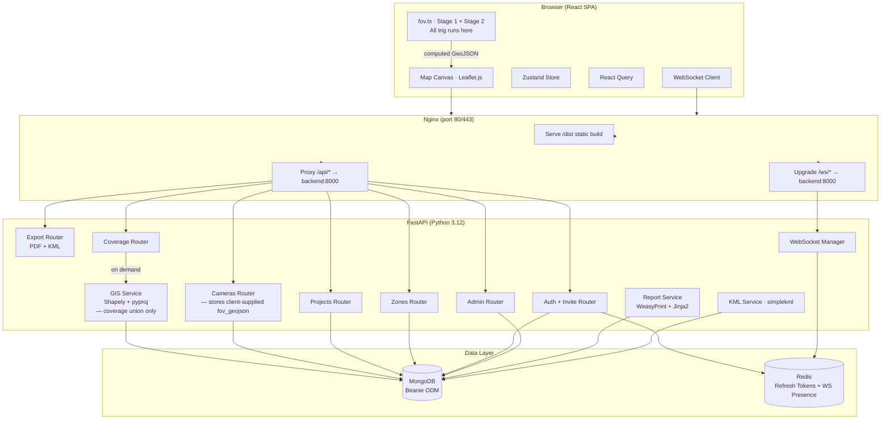

# SPEC.md — CCTV Survey Planner

**Version:** 1.1  
**Date:** March 2026  
**Status:** Approved for Implementation  
**Change:** Added Stage 1 geometric coverage (varifocal lens, tilt-aware trapezoid) and Stage 2 DORI performance analysis (IEC EN 62676-4:2015) per CCTV_Stage1_Stage2_DORI.pdf.

---

## 1. Project Overview

The CCTV Survey Planner is a web-based, multi-user GIS application for security consultants, surveyors, and facility managers to plan and validate CCTV camera deployments on a 2D map before physical installation.

Users place cameras on a map, configure field-of-view (FOV) parameters, draw coverage zones and perimeters, and generate PDF reports and KML exports. The core value proposition is visual confirmation of total coverage — identifying blind spots, overlaps, and perimeter gaps prior to installation. Coverage is now expressed not only as a 2D area but also as DORI quality zones (Detection, Observation, Recognition, Identification) per IEC EN 62676-4:2015.

**Primary stakeholders:** Security consultants, facility managers, survey teams.  
**Access model:** Invite-only. Admin users create accounts; no open self-registration.

---

## 2. Goals & Success Criteria

| Goal | Success Criterion |
|---|---|
| Visual FOV planning | User can place a camera and see its FOV trapezoid render on the map within 500ms of stopping an edit |
| DORI zone visualisation | Four colour-coded DORI zone arcs (Detection / Observation / Recognition / Identification) render inside each FOV polygon immediately, computed client-side with no additional API call |
| Multi-user collaboration | Two editors in the same project see each other's changes within 2 seconds via WebSocket |
| Coverage analysis | "Recalculate Coverage" returns total covered area (m²), overlap zones, and uncovered sub-regions as map overlays |
| Report generation | PDF report generated and downloaded within 10 seconds, containing map screenshot, camera table, DORI summary per camera, and coverage summary |
| KML export | KML file exports correctly and opens in Google Earth with camera placemarks, FOV trapezoids, and DORI zone polygons |
| Access control | Viewer-role users receive HTTP 403 on any mutating operation; enforced server-side |

---

## 3. Scope

### In Scope

- Invite-only user authentication with JWT
- Admin user management (invite token generation, role assignment)
- Camera model library (per-user, private) — extended to carry varifocal lens and sensor parameters
- Project creation, management, and collaborator invitations
- 2D map-based camera placement, drag-to-move, bearing rotation
- **Stage 1 — Geometric FOV:** Tilt-aware trapezoidal ground footprint computed client-side from mounting height, tilt angle, and varifocal H/V angles; rendered as a GeoJSON trapezoid on the map
- **Stage 2 — DORI analysis:** Client-side computation of Detection / Observation / Recognition / Identification distance boundaries and zone areas per IEC EN 62676-4:2015; rendered as concentric colour-coded trapezoid sub-zones within the FOV
- All Stage 1 and Stage 2 calculations run entirely in the browser (`src/utils/fov.ts`) — no additional backend round-trip required for parameter changes
- The backend stores the final computed `fov_geojson` (including DORI sub-zones as a GeoJSON FeatureCollection) on save/persist — it does **not** recompute; it trusts the client-supplied geometry
- On-demand coverage analysis (union of FOVs, gap detection, overlap highlighting) — server-side using Shapely
- Zone/perimeter drawing tools (polygon and polyline)
- Auto-save and manual save
- Real-time multi-user collaboration via WebSocket
- Role-based access control (Owner / Editor / Viewer)
- PDF report generation (server-side, client-supplied map image + DORI stats per camera)
- KML export (including DORI zone polygons as separate styled features)
- Docker Compose deployment (provider-agnostic)

### Out of Scope

- Open self-registration
- Server-side Stage 1 / Stage 2 recalculation per camera edit (all FOV+DORI math is client-side)
- Video feed integration or live camera connectivity
- AI-based camera placement optimisation
- Mobile-native app (responsive web only)
- Offline / PWA mode
- Undo/redo history
- Shared global camera model library
- SMTP email delivery (invite links are copy-paste, no email sending required)

---

## 4. Architecture

### 4.1 Architecture Diagram



### 4.2 Component Descriptions

---

**Nginx**
- **Responsibility:** Reverse proxy and static asset server. Terminates HTTP, serves the compiled React build from `/dist`, proxies `/api/*` to FastAPI, and upgrades `/ws/*` connections to WebSocket.
- **Technology:** Nginx (Alpine Docker image)
- **Interfaces:** Ingress on port 80 (443 if TLS terminated here). Upstream: `backend:8000`.

---

**React Frontend**
- **Responsibility:** Single-page application. Renders the map canvas, toolbar, left panel, and camera/zone editing UI. Manages all client-side state. **Owns all Stage 1 and Stage 2 FOV + DORI calculations.**
- **Technology:** React 18 + Vite, Leaflet.js, Leaflet.draw, Zustand, React Query, Axios, Tailwind CSS
- **Interfaces:**
  - REST calls to `/api/v1/*` via Axios + React Query
  - WebSocket connection to `/ws/projects/{id}`
  - Emits map canvas as base64 PNG for report generation
  - Emits `fov_geojson` and `ir_fov_geojson` (both FeatureCollections) to backend on camera save

**Zustand store slices:**
- `authSlice` — current user, JWT access token
- `projectSlice` — active project metadata, collaborators
- `cameraSlice` — camera instances array, selected camera ID
- `zoneSlice` — zone array, selected zone ID
- `mapSlice` — active tool, layer visibility toggles, map bounds, `irMode: boolean` (global IR mode toggle — switches all cameras between `fov_geojson` and `ir_fov_geojson` rendering)
- `coverageSlice` — latest coverage stats result, last computed timestamp

---

**`src/utils/fov.ts` — Client-Side FOV & DORI Engine**
- **Responsibility:** All Stage 1 geometric and Stage 2 DORI calculations. Computes both `fov_geojson` (full daytime geometry) and `ir_fov_geojson` (IR-truncated geometry) in a single call. Both are stored on the camera instance. The IR mode toggle only switches which stored result is rendered — it never triggers recalculation.
- **Technology:** Pure TypeScript; no external dependencies beyond standard `Math.*`
- **Key exported functions:**

```typescript
// Stage 1A — Interpolate H and V angles for chosen focal length
interpolateAngles(params: VarifocalParams): { hAngle: number; vAngle: number }

// Stage 1B — Near and far ground distances from camera tilt geometry
computeGroundDistances(H: number, tiltDeg: number, vAngleDeg: number): { dNear: number; dFar: number }

// Stage 1C/D — Trapezoidal coverage area (m²) and corner coordinates
computeTrapezoid(lat: number, lng: number, bearing: number,
                 hAngleDeg: number, dNear: number, dFar: number): TrapezoidResult

// Stage 2 — PPM at a given horizontal distance from the camera
computePPM(d: number, H: number, hAngleDeg: number, R_H: number): number

// Stage 2 — Horizontal ground distance at which a PPM threshold is achieved
computeDORIDistance(ppmThreshold: number, H: number, hAngleDeg: number, R_H: number): number

// Master function — computes and returns BOTH FeatureCollections in one pass:
//   fov_geojson:    full daytime geometry (D_far from tilt + render distance cap)
//   ir_fov_geojson: IR-truncated geometry (D_far additionally capped at ir_range depth)
//                   null if model.ir_range is null
// Each FeatureCollection contains:
//   - feature[0]: full FOV trapezoid (Stage 1 outer boundary)
//   - feature[1..4]: DORI sub-zone trapezoids (Identification, Recognition, Observation, Detection)
//   - properties on each feature: zone type, distances, widths, area_m2, ppm values, is_ir_truncated
computeFOVFeatureCollection(
  camera: CameraInstance,
  model: ResolvedCameraModel
): { fov_geojson: GeoJSON.FeatureCollection; ir_fov_geojson: GeoJSON.FeatureCollection | null }
```

**Coordinate projection:** All geodesic offset calculations (projecting a point at bearing + distance from an origin lat/lng) use the standard WGS84 approximation `(lat + Δlat, lng + Δlng)` with the Haversine-compatible formula. This is sufficient accuracy for distances up to 500m. The same formula is used in `fov.ts` and in the Python backend GIS service (pyproj geodesic) — results will agree to within rounding.

---

**FastAPI Backend**
- **Responsibility:** Stateless REST API and WebSocket server. Handles auth, all CRUD operations, stores client-supplied FOV GeoJSON, runs server-side coverage union analysis, generates PDF/KML.
- **Technology:** Python 3.12, FastAPI, Uvicorn, Beanie (ODM), python-jose (JWT), passlib (bcrypt)
- **Interfaces:** HTTP/1.1 REST on port 8000; WebSocket on same port at `/ws/*`
- **Note:** The backend does **not** recompute FOV or DORI polygons on camera PUT/POST. It receives both `fov_geojson` and `ir_fov_geojson` already computed by the client and persists them as-is. The GIS service is used only for coverage union/intersection analysis (which uses `fov_geojson` outer trapezoid only).

---

**GIS Service** *(internal Python module, no HTTP boundary)*
- **Responsibility:** Coverage union and intersection analysis using Shapely. Consumes the persisted `fov_geojson` polygons; does **not** recompute them.
- **Technology:** Shapely 2.x, pyproj
- **Interfaces:**
  - `compute_coverage_stats(fov_polygons: list[Polygon], zone_polygons: list[Polygon]) → CoverageStats`

---

**WebSocket Manager** *(in-process, FastAPI)*
- **Responsibility:** Maintains a registry of active WebSocket connections keyed by `project_id`. Broadcasts mutation events to all connected clients in a project room except the originating connection.
- **Technology:** FastAPI WebSocket, Redis (for presence tracking only in V1)
- **Interfaces:**
  - Inbound: connection at `/ws/projects/{id}?token={jwt}`
  - Outbound broadcast message types: `camera_updated`, `camera_added`, `camera_deleted`, `zone_updated`, `zone_added`, `zone_deleted`, `coverage_recalculated`, `user_joined`, `user_left`

---

**Report Service**
- **Responsibility:** Accepts a base64 map image from the client, fetches project data from MongoDB, renders a Jinja2 HTML template (including per-camera DORI table), and converts to PDF via WeasyPrint.
- **Technology:** WeasyPrint, Jinja2
- **Interfaces:** Called by `POST /api/v1/projects/{id}/report`. Streams PDF bytes back as `application/pdf`.

---

**KML Service**
- **Responsibility:** Fetches all cameras and zones for a project and generates a `.kml` file. Exports the full `fov_geojson` FeatureCollection per camera — each DORI sub-zone as a separately styled KML Polygon feature.
- **Technology:** simplekml
- **Interfaces:** Called by `GET /api/v1/projects/{id}/export/kml`. Returns `application/vnd.google-earth.kml+xml`.

---

**MongoDB**
- **Responsibility:** Primary persistent store for all application data.
- **Technology:** MongoDB 7.x, Beanie async ODM
- **Collections:** `users`, `invite_tokens`, `camera_models`, `projects`, `camera_instances`, `zones`

---

**Redis**
- **Responsibility:** JWT refresh token store (with TTL) and WebSocket presence set (user IDs per project room).
- **Technology:** Redis 7.x
- **Key patterns:**
  - `refresh:{token_hash}` → `user_id` (TTL: 7 days)
  - `presence:{project_id}` → Set of `user_id` strings (TTL: refreshed on heartbeat)

---

## 5. Data Model

### 5.1 Entities

---

**User**
```
_id:            ObjectId        PK
email:          string          unique, indexed
password_hash:  string          bcrypt
display_name:   string
system_role:    enum            [admin, user]
created_at:     datetime
```

---

**InviteToken**
```
_id:            ObjectId        PK
token_hash:     string          SHA-256 hash; indexed unique
email:          string          intended recipient
created_by:     ObjectId        → User
expires_at:     datetime        72 hours from creation
used_at:        datetime | null
created_at:     datetime
```

---

**CameraModel** *(per-user template library — extended for Stage 1 + Stage 2)*
```
_id:              ObjectId      PK
owner_id:         ObjectId      → User; indexed
name:             string        e.g. "Hikvision DS-2CD2143G2"
manufacturer:     string

--- Stage 1 optics ---
focal_length_min: float         mm; minimum focal length (widest angle)
focal_length_max: float         mm; maximum focal length (narrowest angle)
h_angle_max:   float         degrees; horizontal FOV at focal_length_min (widest angle)
h_angle_min:   float         degrees; horizontal FOV at focal_length_max (narrowest angle)
v_angle_max:   float         degrees; vertical FOV at focal_length_min (widest angle)
v_angle_min:   float         degrees; vertical FOV at focal_length_max (narrowest angle)

--- Stage 2 sensor ---
sensor_resolution_h: int        horizontal pixel count (e.g. 1920, 2560, 3840)
sensor_aspect_ratio: float      e.g. 1.777... for 16:9

--- Legacy / fixed-lens fallback ---
fov_angle:        float | null  horizontal FOV in degrees — used only if focal_length_min
                                == focal_length_max (fixed-lens camera)
max_fov_render_distance: float         metres; > 0  — caps D_far for map rendering; use Detection distance (25 PPM) as a principled default
dead_zone:               float         metres; >= 0 — near-field blind spot radius; region directly in front of camera where coverage is ineffective

--- IR illumination (informational only — not used in FOV or DORI calculations) ---
ir_range:         float | null  metres; effective IR illumination distance at which the
                                built-in IR LEDs provide usable night-vision; null = no IR
                                / unknown. Displayed on map as a separate reference circle
                                overlay; does not affect trapezoid geometry or PPM values.

notes:            string
created_at:       datetime
```

*For fixed-lens cameras, set `focal_length_min == focal_length_max` and populate `fov_angle` directly. The frontend interpolation formula collapses to the fixed value. For varifocal cameras, `fov_angle` is ignored; the frontend interpolates from the focal length range.*

*`ir_range` is used to compute `ir_fov_geojson` — the IR-truncated version of the FOV trapezoid stored on each `CameraInstance`. When IR mode is active, the map renders `ir_fov_geojson` instead of `fov_geojson`. It has no effect on daytime FOV trapezoid geometry, DORI distance calculations, or coverage union analysis.*

---

**Project**
```
_id:            ObjectId        PK
name:           string
description:    string
owner_id:       ObjectId        → User; indexed
collaborators:  [
  { user_id: ObjectId, role: enum [editor, viewer] }
]
base_map: {
  center_lat:   float
  center_lng:   float
  default_zoom: int             (1–22)
}
coverage_stats: {
  total_covered_m2:   float
  overlap_geojson:    GeoJSON FeatureCollection | null
  gap_geojson:        GeoJSON FeatureCollection | null
  computed_at:        datetime | null
} | null
created_at:     datetime
updated_at:     datetime
```

---

**CameraInstance** *(placed camera on map — extended for Stage 1 + Stage 2)*
```
_id:                  ObjectId  PK
project_id:           ObjectId  → Project; indexed
model_id:             ObjectId  → CameraModel
label:                string    e.g. "CAM-01"
position: {
  lat:                float
  lng:                float
}
bearing:              float     degrees from North (0–360)

--- Stage 1 instance overrides ---
mounting_height:      float     metres above ground (default pulled from model or project default)
tilt_angle:           float     degrees downward from horizontal (0 = horizontal, 90 = straight down)
chosen_focal_length:  float     mm; must be within [model.focal_length_min, model.focal_length_max]
override_h_angle:     float | null   null = interpolate from focal length
override_v_angle:     float | null   null = interpolate from focal length
override_fov_render_distance:   float | null   null = use model.max_fov_render_distance (caps geometry display)

--- Stage 2 instance overrides ---
override_resolution_h: int | null    null = use model.sensor_resolution_h

--- Computed by client, both stored verbatim, recomputed together on any parameter change ---
fov_geojson:          GeoJSON FeatureCollection
                      — Full daytime geometry; D_far derived from tilt + override_fov_render_distance
                      — Feature[0]: full FOV trapezoid (Stage 1 outer boundary)
                      — Feature[1]: Identification zone trapezoid (≥250 PPM, or up to D_far)
                      — Feature[2]: Recognition zone trapezoid (125–249 PPM, or remaining depth)
                      — Feature[3]: Observation zone trapezoid (62–124 PPM, or remaining depth)
                      — Feature[4]: Detection zone trapezoid (25–61 PPM, or remaining depth)
                      Each feature carries a `properties` object — see Section 5.3

ir_fov_geojson:       GeoJSON FeatureCollection | null
                      — IR-truncated geometry; identical structure to fov_geojson but
                        D_far capped at ir_range depth along camera axis
                      — null if model.ir_range is null (camera has no IR)
                      — DORI sub-zones also truncated to IR depth; DORIInfoPanel reads
                        from this when IR mode is active
                      — Recomputed together with fov_geojson on every parameter change;
                        never recomputed on IR mode toggle (toggle just swaps which
                        field is rendered)

--- Display toggles (never trigger recomputation) ---
is_fov_visible:       boolean
dori_zones_visible:   boolean   show/hide DORI sub-zone colour bands
color:                string    hex colour for the outer FOV trapezoid e.g. "#3388ff"
created_at:           datetime
updated_at:           datetime
```

**Recomputation triggers** — both `fov_geojson` and `ir_fov_geojson` are recomputed together in a single `computeFOVFeatureCollection` call whenever any of the following change:

| Field changed | Reason |
|---|---|
| `bearing` | Geometry rotates |
| `chosen_focal_length` | H/V angles change via interpolation |
| `mounting_height` | D_near / D_far change |
| `tilt_angle` | D_near / D_far change |
| `override_h_angle` / `override_v_angle` | Angles change directly |
| `override_fov_render_distance` | D_far cap changes |
| `override_resolution_h` | DORI distances change |
| `position` (drag) | Coordinates of all vertices change |

The following do **not** trigger recomputation:

| Field changed | Reason |
|---|---|
| IR mode toggle (global) | Swaps rendered field between `fov_geojson` and `ir_fov_geojson` |
| `dori_zones_visible` | Show/hide only |
| `is_fov_visible` | Show/hide only |
| `color` | Style property only |
| `label` | Metadata only |

---

**Zone**
```
_id:          ObjectId          PK
project_id:   ObjectId          → Project; indexed
label:        string
type:         enum              [polygon, polyline]
geojson:      GeoJSON Geometry  Polygon or LineString
purpose:      enum              [coverage_area, perimeter, exclusion, note]
color:        string
created_at:   datetime
updated_at:   datetime
```

### 5.2 Storage Strategy

- **Database:** MongoDB 7.x running in Docker container, data volume mounted at `./data/mongo`.
- **ODM:** Beanie (async Pydantic v2). All documents defined as Beanie `Document` subclasses with explicit index declarations.
- **Indexes:**
  - `users`: unique on `email`
  - `invite_tokens`: unique on `token_hash`
  - `camera_models`: on `owner_id`
  - `camera_instances`: on `project_id`
  - `zones`: on `project_id`
  - `projects`: on `owner_id`; sparse multikey on `collaborators.user_id`
- **Migrations:** No migration framework in V1.
- **Backups:** Host-level `mongodump` cron job.

### 5.3 `fov_geojson` and `ir_fov_geojson` FeatureCollection Structure

Both `fov_geojson` and `ir_fov_geojson` share an identical 5-feature GeoJSON FeatureCollection structure. They are computed together in a single `computeFOVFeatureCollection` call in `src/utils/fov.ts` and stored verbatim by the backend. The only difference is the effective `D_far` used:

- `fov_geojson` — `D_far` from tilt geometry capped by `override_fov_render_distance` or `model.max_fov_render_distance`
- `ir_fov_geojson` — `D_far` additionally capped at the IR far ground distance derived from `model.ir_range` using the same tilt geometry formula: `D_far_ir = min(D_far_daytime, H / tan(θ − V_angle/2))` where the tilt geometry produces the ground distance at which the IR axis reaches `ir_range` slant distance

The frontend switches between them purely on the global IR mode toggle — no recalculation occurs on toggle.

```jsonc
{
  "type": "FeatureCollection",
  "features": [
    {
      "type": "Feature",
      "properties": {
        "zone": "fov_outer",
        "d_near_m": 4.0,
        "d_far_m": 14.9,          // ir_fov_geojson: this is the IR-capped value
        "w_near_m": 3.9,
        "w_far_m": 14.6,
        "area_m2": 100.8,
        "h_angle_deg": 52.0,
        "v_angle_deg": 30.0,
        "mounting_height_m": 4.0,
        "tilt_deg": 30.0,
        "chosen_focal_length_mm": 6.0,
        "is_ir_truncated": false   // true in ir_fov_geojson when ir_range < daytime D_far
      },
      "geometry": { "type": "Polygon", "coordinates": [[...trapezoid 4 corners + close]] }
    },
    {
      "type": "Feature",
      "properties": {
        "zone": "dori_identification",
        "ppm_threshold": 250,
        "d_inner_m": 4.0,
        "d_outer_m": 9.7,
        "area_m2": 38.2,
        "ppm_at_inner": 329,
        "ppm_at_outer": 250
      },
      "geometry": { "type": "Polygon", "coordinates": [[...]] }
    },
    {
      "type": "Feature",
      "properties": {
        "zone": "dori_recognition",
        "ppm_threshold": 125,
        "d_inner_m": 9.7,
        "d_outer_m": 14.9,
        "area_m2": 62.6,
        "ppm_at_inner": 250,
        "ppm_at_outer": 125
      },
      "geometry": { "type": "Polygon", "coordinates": [[...]] }
    },
    {
      "type": "Feature",
      "properties": {
        "zone": "dori_observation",
        "ppm_threshold": 62,
        "d_inner_m": 14.9,
        "d_outer_m": 14.9,
        "area_m2": 0,
        "note": "extends beyond d_far — entire footprint meets observation"
      },
      "geometry": null
    },
    {
      "type": "Feature",
      "properties": {
        "zone": "dori_detection",
        "ppm_threshold": 25,
        "d_inner_m": 14.9,
        "d_outer_m": 14.9,
        "area_m2": 0,
        "note": "extends beyond d_far — entire footprint meets detection"
      },
      "geometry": null
    }
  ]
}
```

*When a DORI boundary distance exceeds `d_far`, the zone geometry is `null` and a `note` property records the limiting factor. The frontend renders only features with non-null geometry. `DORIInfoPanel` reads distances and areas from whichever FeatureCollection is currently active (day or IR mode) — no extra calculation required.*

---

## 6. Stage 1 & Stage 2 Calculation Specification

This section is the authoritative reference for the mathematics implemented in `src/utils/fov.ts`. The backend does **not** implement these calculations.

### 6.1 Stage 1 — Geometric Coverage Calculation

#### Step 1A — Angle Interpolation (Varifocal)

For a chosen focal length `f` within `[f_min, f_max]`:

```
H_angle = h_angle_max − [(f − f_min) / (f_max − f_min)] × (h_angle_max − h_angle_min)
V_angle = v_angle_max − [(f − f_min) / (f_max − f_min)] × (v_angle_max − v_angle_min)
```

Where `h_angle_max` / `v_angle_max` are the angles at `f_min` (widest), and `h_angle_min` / `v_angle_min` are at `f_max` (narrowest). For fixed-lens cameras `f_min == f_max`, so `H_angle = h_angle_max` and `V_angle = v_angle_max` directly.

If `override_h_angle` or `override_v_angle` are set on the instance, they replace the interpolated values entirely.

#### Step 1B — Ground Distances (Tilt Geometry)

With mounting height `H` (metres) and downward tilt `θ` (degrees):

```
D_near = H / tan(θ + V_angle/2)     # closest illuminated ground point
D_far  = H / tan(θ − V_angle/2)     # furthest illuminated ground point
```

**Validity guard:** `θ > V_angle / 2` must hold; otherwise the camera's upper FOV boundary points at or above the horizon and `D_far` is infinite. If this condition is not met, the frontend must display a validation warning ("Tilt angle too shallow — camera sees sky") and clamp `D_far` to `override_fov_render_distance` or `model.max_fov_render_distance` as a fallback display value.

If `override_fov_render_distance` is set, `D_far = min(D_far, override_fov_render_distance)` is applied after tilt geometry.

#### Step 1C — Widths at Near and Far Edges

```
W_near = 2 × D_near × tan(H_angle / 2)
W_far  = 2 × D_far  × tan(H_angle / 2)
```

#### Step 1D — Trapezoidal Coverage Area

```
Area = 0.5 × (W_near + W_far) × (D_far − D_near)    [m²]
```

#### Step 1E — Map Coordinates of Trapezoid Corners

The four corners of the trapezoid on the map are geodesically projected from the camera position `(lat, lng)` using the camera's `bearing`:

```
Corner NL (near-left):  project (lat, lng) at bearing (bearing − H_angle/2), distance D_near
Corner NR (near-right): project (lat, lng) at bearing (bearing + H_angle/2), distance D_near
Corner FL (far-left):   project (lat, lng) at bearing (bearing − H_angle/2), distance D_far
Corner FR (far-right):  project (lat, lng) at bearing (bearing + H_angle/2), distance D_far
```

GeoJSON Polygon vertex order: `[NL, NR, FR, FL, NL]` (closed ring).

Geodesic projection formula (WGS84 approximation, adequate for <500m):
```typescript
const R = 6378137; // Earth radius in metres
const δ = distance / R;
const latRad = toRad(lat);
const lngRad = toRad(lng);
const bearRad = toRad(bearing);

const lat2 = Math.asin(
  Math.sin(latRad) * Math.cos(δ) +
  Math.cos(latRad) * Math.sin(δ) * Math.cos(bearRad)
);
const lng2 = lngRad + Math.atan2(
  Math.sin(bearRad) * Math.sin(δ) * Math.cos(latRad),
  Math.cos(δ) − Math.sin(latRad) * Math.sin(lat2)
);
return { lat: toDeg(lat2), lng: toDeg(lng2) };
```

### 6.2 Stage 2 — DORI Performance Analysis (IEC EN 62676-4:2015)

#### DORI Thresholds

| Level | PPM Threshold | Capability |
|---|---|---|
| Detection | ≥ 25 PPM | Presence of person/vehicle determinable |
| Observation | ≥ 62 PPM | Clothing, direction of travel visible |
| Recognition | ≥ 125 PPM | Same individual matched; plates may be readable |
| Identification | ≥ 250 PPM | Positive ID beyond reasonable doubt; clear facial features |

#### Step 2A — PPM at Horizontal Distance `d`

Slant distance accounts for mounting height:

```
D_slant(d) = sqrt(d² + H²)

PPM(d) = R_H / [2 × D_slant(d) × tan(H_angle / 2)]
```

#### Step 2B — DORI Horizontal Distance for Each Threshold

Rearranging the PPM formula:

```
D_slant_DORI = R_H / (2 × PPM_threshold × tan(H_angle / 2))
D_horiz_DORI = sqrt(D_slant_DORI² − H²)
```

Computed for PPM_threshold ∈ {250, 125, 62, 25}.

#### Step 2C — Clamping DORI Distances to Geometric Footprint

Each `D_horiz_DORI` is clamped to `D_far`:

```
D_identification = min(D_horiz at 250 PPM, D_far)
D_recognition    = min(D_horiz at 125 PPM, D_far)
D_observation    = min(D_horiz at  62 PPM, D_far)
D_detection      = min(D_horiz at  25 PPM, D_far)
```

If `D_horiz_DORI > D_far`, the zone extends beyond the geometric footprint. The entire footprint meets that DORI level — the zone geometry is `null` in `fov_geojson`, and the properties carry the `"note"` field.

#### Step 2D — DORI Zone Trapezoid Coordinates

Each DORI zone occupies the annular strip between two distances. Its four corners are projected identically to Step 1E, substituting `D_inner` and `D_outer`:

```
W_inner = 2 × D_inner × tan(H_angle / 2)
W_outer = 2 × D_outer × tan(H_angle / 2)
A_zone  = 0.5 × (W_inner + W_outer) × (D_outer − D_inner)
```

Zone strips (inner → outer):

| Zone | D_inner | D_outer |
|---|---|---|
| Identification | D_near | D_identification |
| Recognition | D_identification | D_recognition |
| Observation | D_recognition | D_observation |
| Detection | D_observation | D_detection |

Where D_near comes from Step 1B.

#### Step 2E — DORI Colour Coding (Frontend Rendering)

| Zone | Fill Colour | Opacity |
|---|---|---|
| Identification | `#1a237e` (deep blue) | 0.55 |
| Recognition | `#388e3c` (green) | 0.45 |
| Observation | `#f57c00` (amber) | 0.40 |
| Detection | `#c62828` (red) | 0.30 |
| FOV outer boundary | Per-camera `color` | stroke only, no fill |

These are defaults; the Layers tab may expose a global DORI palette toggle (monochrome vs. colour).

---

## 7. API & Integration Contracts

All REST endpoints prefixed `/api/v1`. All requests/responses in JSON unless noted. All protected endpoints require `Authorization: Bearer {access_token}` header.

### 7.1 Authentication & Invite

| Method | Endpoint | Auth | Description |
|---|---|---|---|
| POST | `/auth/login` | None | Email + password → access + refresh tokens |
| POST | `/auth/refresh` | None | Refresh token → new access token |
| POST | `/auth/logout` | Required | Invalidate refresh token in Redis |
| GET | `/auth/accept-invite` | None | Validate invite token, return token metadata |
| POST | `/auth/accept-invite` | None | Complete registration |

**POST `/auth/login`**
```json
Request:  { "email": "string", "password": "string" }
Response: { "access_token": "string", "refresh_token": "string", "token_type": "bearer" }
Errors:   401 invalid credentials
```

### 7.2 Admin

| Method | Endpoint | Auth | Description |
|---|---|---|---|
| GET | `/admin/users` | Admin | List all users |
| POST | `/admin/invite` | Admin | Generate invite token |
| DELETE | `/admin/users/{user_id}` | Admin | Deactivate user |

### 7.3 Camera Models

| Method | Endpoint | Auth | Description |
|---|---|---|---|
| GET | `/camera-models` | Required | List caller's camera models |
| POST | `/camera-models` | Required | Create model |
| GET | `/camera-models/{id}` | Required | Get single model |
| PUT | `/camera-models/{id}` | Required | Update model |
| DELETE | `/camera-models/{id}` | Required | Delete model |

**POST/PUT `/camera-models` request:**
```json
{
  "name": "string",
  "manufacturer": "string",
  "focal_length_min": "float (mm)",
  "focal_length_max": "float (mm)",
  "h_angle_max": "float (degrees, 1–180)",
  "h_angle_min": "float (degrees, 1–180)",
  "v_angle_max": "float (degrees, 1–180)",
  "v_angle_min": "float (degrees, 1–180)",
  "sensor_resolution_h": "int (pixels, e.g. 1920)",
  "sensor_aspect_ratio": "float (e.g. 1.7778 for 16:9)",
  "max_fov_render_distance": "float (metres, >0)",
  "dead_zone": "float (metres, >=0)",
  "ir_range": "float | null (metres, >0 — null if no IR or unknown)",
  "fov_angle": "float | null  (fixed-lens only)",
  "notes": "string"
}
```

### 7.4 Projects

*(Unchanged from v1.0 — see previous section)*

### 7.5 Cameras

| Method | Endpoint | Auth | Description |
|---|---|---|---|
| POST | `/projects/{id}/cameras` | Owner/Editor | Place camera; stores client-supplied fov_geojson |
| PUT | `/projects/{id}/cameras/{cam_id}` | Owner/Editor | Update camera; stores updated fov_geojson |
| DELETE | `/projects/{id}/cameras/{cam_id}` | Owner/Editor | Remove camera |

**POST/PUT camera request:**
```json
{
  "model_id": "ObjectId string",
  "label": "string",
  "position": { "lat": "float", "lng": "float" },
  "bearing": "float (0–360)",
  "mounting_height": "float (metres)",
  "tilt_angle": "float (degrees, 0–89)",
  "chosen_focal_length": "float (mm)",
  "override_h_angle": "float | null",
  "override_v_angle": "float | null",
  "override_fov_render_distance": "float | null",
  "override_resolution_h": "int | null",
  "is_fov_visible": "boolean",
  "dori_zones_visible": "boolean",
  "color": "hex string",
  "fov_geojson": "GeoJSON FeatureCollection (daytime — computed by client)",
  "ir_fov_geojson": "GeoJSON FeatureCollection | null (IR-truncated — computed by client; null if model.ir_range is null)"
}
```

**Response:** Full `CameraInstance` document including stored `fov_geojson` and `ir_fov_geojson`.  
**Backend behaviour:** Backend validates that `fov_geojson` is a valid GeoJSON FeatureCollection and `ir_fov_geojson` is a valid FeatureCollection or null (schema check only — no recomputation). Stores both as-is.  
**Side effect:** WebSocket broadcast `camera_updated` / `camera_added` to project room — payload includes both `fov_geojson` and `ir_fov_geojson` so remote clients render immediately without recalculating.

### 7.6 Zones

*(Unchanged from v1.0)*

### 7.7 Coverage Analysis

| Method | Endpoint | Auth | Description |
|---|---|---|---|
| POST | `/projects/{id}/coverage` | Owner/Editor | Run server-side union/gap analysis on stored fov_geojson geometries |

The backend extracts `feature[0]` (the outer FOV trapezoid) from each camera's `fov_geojson` FeatureCollection and passes these to `compute_coverage_stats()` in the GIS Service. DORI sub-zone features are not used in coverage union analysis.

**Response:**
```json
{
  "total_covered_m2": "float",
  "overlap_geojson": "GeoJSON FeatureCollection | null",
  "gap_geojson": "GeoJSON FeatureCollection | null",
  "computed_at": "ISO8601 datetime"
}
```

### 7.8 Export & Reports

| Method | Endpoint | Auth | Description |
|---|---|---|---|
| POST | `/projects/{id}/report` | Any role | Generate PDF report (includes DORI table per camera) |
| GET | `/projects/{id}/export/kml` | Any role | Download KML (includes DORI sub-zones as styled features) |

**POST `/projects/{id}/report` request:**
```json
{
  "map_image_base64": "string (PNG, base64-encoded)",
  "include_coverage_stats": "boolean",
  "include_dori_table": "boolean"
}
```

**PDF report content additions (v1.1):**
- Per-camera DORI summary table: Identification distance (m), Recognition distance (m), Observation distance (m), Detection distance (m), Identification zone area (m²), total FOV area (m²)
- Footer note: *"DORI distances computed per IEC EN 62676-4:2015 using slant-distance PPM formula. Results are design-guide estimates; actual performance may vary with lighting, compression, and lens quality."*

**KML export additions (v1.1):**
- Each DORI sub-zone (Identification, Recognition, Observation, Detection) exported as a separate styled KML Polygon placemark, colour-coded per the DORI palette, grouped under a `<Folder>` named after the camera label.

### 7.9 WebSocket

*(Unchanged from v1.0 — broadcast envelope and message types are the same)*

---

## 8. Authentication & Authorisation

*(Unchanged from v1.0 — roles and permissions matrix is the same)*

---

## 9. Non-Functional Requirements

| Concern | Requirement | Approach |
|---|---|---|
| FOV + DORI render latency | Full trapezoid + DORI zones visible within 500ms of user stopping a parameter edit | 300ms debounce; all math in `fov.ts` is synchronous and <1ms per camera |
| No round-trip for FOV edits | Changing bearing, focal length, tilt, height, or resolution must **not** trigger an API call — only a debounced PUT on save | `fov.ts` runs in-browser; API called only to persist, not to compute |
| IR mode toggle latency | Switching IR mode on/off must be instantaneous — no recalculation, no API call | Both `fov_geojson` and `ir_fov_geojson` already stored on the instance; toggle swaps which is rendered |
| Coverage analysis | Response within 5 seconds for up to 50 cameras and 20 zones | Shapely `unary_union` via `run_in_executor` in FastAPI |
| WebSocket broadcast | Change visible to other users within 2 seconds | In-process broadcast; full `fov_geojson` FeatureCollection included in `camera_updated` payload so remote clients re-render immediately without recomputing |
| API availability | Best-effort; no SLA for V1 | Docker Compose `unless-stopped` restart policies |
| Security | bcrypt cost 12; JWTs 15min; HTTPS in production | passlib[bcrypt], Nginx SSL |
| Input validation | All API inputs validated with Pydantic v2 | Field constraints: tilt 0–89°, focal length within model bounds, resolution >0 |
| Scalability | <50 concurrent users, <200 projects | Single-instance deployment |
| Browser support | Latest two versions of Chrome, Firefox, Safari, Edge | Vite `es2020` target |

---

## 10. Infrastructure & Deployment

*(Unchanged from v1.0 — Docker Compose, env vars, monorepo structure, CI/CD)*

**Monorepo structure addition:**
```
packages/frontend/src/
  utils/
    fov.ts          ← Stage 1 + Stage 2 calculation engine (new)
    geo.ts          ← geodesic projection helpers (new)
  components/
    camera/
      CameraEditPanel.tsx    ← extended with varifocal + tilt + height + DORI display
      DORIInfoPanel.tsx      ← per-camera DORI distances and zone area summary (new)
  store/
    cameraSlice.ts           ← extended with new CameraInstance fields
```

---

## 11. Implementation Plan

### Phase 1 — Foundation (Weeks 1–3)

*(Unchanged)*

### Phase 2 — Core Map Features (Weeks 4–6)

- [ ] Backend: Camera model CRUD (`/camera-models` routes) — updated schema with varifocal + sensor fields
- [ ] Backend: Project CRUD (`/projects` routes)
- [ ] Backend: Camera instance routes — POST and PUT accepting and storing client-supplied `fov_geojson` (no backend recomputation)
- [ ] **Frontend: `src/utils/geo.ts` — geodesic projection helper (`projectPoint(lat, lng, bearing, distance) → {lat, lng}`)**
- [ ] **Frontend: `src/utils/fov.ts` — Stage 1 implementation: `interpolateAngles`, `computeGroundDistances`, `computeTrapezoid`, `buildTrapezoidGeoJSON`**
- [ ] **Frontend: `src/utils/fov.ts` — Stage 2 implementation: `computePPM`, `computeDORIDistance`, `buildDORIFeatures`**
- [ ] **Frontend: `src/utils/fov.ts` — `computeFOVFeatureCollection` master function combining Stage 1 + Stage 2 output**
- [ ] Frontend: Project dashboard (list, create, open project)
- [ ] Frontend: Map canvas with Leaflet.js + Stadia Maps tiles
- [ ] Frontend: Camera model management UI — updated form with varifocal focal range, H/V angle range, sensor resolution, aspect ratio fields
- [ ] Frontend: Place camera on map → call `computeFOVFeatureCollection` immediately → render trapezoid + DORI sub-zones → POST camera with fov_geojson
- [ ] Frontend: Drag camera to reposition → recompute fov_geojson client-side → re-render immediately → debounced PUT
- [ ] Frontend: Bearing rotation handle → recompute → re-render → debounced PUT
- [ ] **Frontend: Camera edit panel — add mounting height input, tilt angle input, focal length slider (with live H/V angle readout), DORI zone toggle**
- [ ] **Frontend: `DORIInfoPanel.tsx` — displays computed Identification / Recognition / Observation / Detection distances and zone areas for selected camera**
- [ ] Frontend: Per-camera and global FOV visibility toggles; global DORI zone visibility toggle
- [ ] Frontend: Camera list in left panel
- [ ] **Frontend: `src/utils/fov.ts` unit tests — validate Stage 1 and Stage 2 outputs against the worked example in CCTV_Stage1_Stage2_DORI.pdf (H=4m, θ=30°, f=6mm, R_H=2560)**

**Phase 2 exit criterion:** User can place a camera with varifocal parameters, mounting height, and tilt angle; see the trapezoidal FOV and four colour-coded DORI zone bands render in real time on the map with no API round-trip; adjust focal length via a slider and see the geometry update instantly.

### Phase 3 — Zones, Collaboration & Save (Weeks 7–9)

*(Unchanged — zone drawing, WebSocket, save)*

### Phase 4 — Coverage Analysis, Reports & Export (Weeks 10–11)

- [ ] Backend: Coverage analysis — extract `feature[0]` (outer trapezoid) from each camera's `fov_geojson`; run Shapely union/gap analysis
- [ ] Backend: Report Service — Jinja2 template updated with per-camera DORI table (Identification / Recognition / Observation / Detection distances and zone areas extracted from `fov_geojson` feature properties)
- [ ] Backend: KML Service — export each camera's DORI sub-zone features as styled KML Polygons in a per-camera `<Folder>`; use DORI colour palette
- [ ] Frontend: "Recalculate Coverage" → POST → render gap/overlap overlays
- [ ] Frontend: Coverage stats display
- [ ] Frontend: "Generate Report" → canvas export → POST with `include_dori_table: true`
- [ ] Frontend: "Export KML" button

**Phase 4 exit criterion:** PDF report contains per-camera DORI distance table. KML opens in Google Earth showing colour-coded DORI zones per camera.

### Phase 5 — Polish & Hardening (Week 12)

- [ ] Full responsive layout review
- [ ] Loading indicators, error toasts, WebSocket reconnect
- [ ] Frontend input validation: tilt > V_angle/2 guard with user-visible warning; focal length within model bounds; mounting height > 0
- [ ] **`src/utils/fov.ts` unit tests: validate against all worked example values from CCTV_Stage1_Stage2_DORI.pdf Section 5 (D_near=4.0m, D_far=14.9m, W_near=3.9m, W_far=14.6m, Area=100.8m², D_identification=9.7m, D_recognition=14.9m, D_identification_area=38.2m², D_recognition_area=62.6m²)**
- [ ] Backend: integration tests for auth, camera CRUD, coverage endpoint
- [ ] Performance: 50-camera project; verify `computeFOVFeatureCollection` completes <5ms per camera in browser
- [ ] Production Docker Compose, security review, README

---

## 12. Open Questions & Risks

| # | Question / Risk | Owner | Status |
|---|---|---|---|
| 1 | **Stadia Maps free tier limits** | Ops | Open |
| 2 | **WeasyPrint system dependencies** — Debian/Ubuntu slim base required | Backend dev | Open |
| 3 | **Leaflet canvas CORS on report generation** — Stadia Maps provides CORS headers; verify in Phase 4 | Frontend dev | Open |
| 4 | **WebSocket scaling** — In-process manager sufficient for single VM V1 | Architect | Accepted for V1 |
| 5 | **FOV accuracy caveat** — Trapezoidal approximation (4 corner points, no arc sweep) slightly understates lateral coverage at high H-angles; acceptable for survey planning. Document in report footer. | Product | Accepted |
| 6 | **MongoDB backup** — Host-level mongodump cron | Ops | Open |
| 7 | **Tilt angle validity guard** — If `θ ≤ V_angle/2`, D_far is infinite. Frontend must warn the user and cap D_far at `max_fov_render_distance`. | Frontend dev | Open |
| 8 | **DORI disclaimer in reports** — Stage 2 PPM formula uses slant distance and a simplified sensor model; sensor quality, IR cut, compression, and scene lighting are not captured. Report footer must carry the IEC EN 62676-4:2015 disclaimer. | Product | Accepted |
| 9 | **`fov_geojson` payload size** — A FeatureCollection of 5 features per camera at 4–8 vertices each is ~2–4 KB JSON. For 50 cameras that is ~200 KB in the project GET response and WebSocket broadcast payload. Acceptable at V1 scale. | Architect | Accepted for V1 |

---

## 13. Assumptions

- All FOV and DORI calculations are 2D flat projections on the ground plane. The trapezoidal model correctly accounts for mounting height and tilt angle in determining D_near and D_far, but lateral geometry is still a horizontal-plane projection.
- The geodesic projection approximation used in `fov.ts` is accurate to within 0.1% for distances up to 500m from the camera.
- Varifocal angle interpolation is linear in focal length — consistent with the IEC reference document formula and adequate for survey planning.
- The application will be deployed on a single VM with Docker Compose.
- Stadia Maps free tier is sufficient for expected tile volume at <50 users.
- SMTP delivery is not required; invite links are distributed manually.
- `pnpm` ≥ 8, Node.js ≥ 18, Python 3.12 required on developer machines.
- Browser support: latest two versions of Chrome, Firefox, Safari, Edge.

---

## 14. Glossary

| Term | Definition |
|---|---|
| FOV | Field of View — the angular extent of a camera's coverage, expressed in degrees |
| Bearing | Direction the camera faces, in degrees clockwise from North (0–360) |
| FOV Trapezoid | A GeoJSON Polygon with four corners representing the tilt-aware trapezoidal ground footprint of the camera (Stage 1 output) |
| Dead zone | The region within `dead_zone` metres of the camera where coverage is ineffective — the near-field blind spot directly in front of the lens |
| IR range | The effective illumination depth of the camera's built-in IR LEDs along the camera axis, in metres. Used to compute `ir_fov_geojson` — an IR-truncated version of the FOV trapezoid. When IR mode is active, the map renders `ir_fov_geojson` instead of `fov_geojson`, showing the reduced nighttime coverage footprint. Does not affect daytime DORI calculations. |
| IR mode | A global map toggle in the Layers tab. When on, all cameras render their `ir_fov_geojson` (IR-truncated trapezoid + DORI zones). When off, all cameras render their `fov_geojson` (full daytime geometry). Switching never triggers recalculation. |
| Tilt angle (θ) | Downward rotation of the camera from horizontal; 0° = horizontal, 90° = straight down |
| Mounting height (H) | Perpendicular height of the camera lens above the ground plane, in metres |
| D_near / D_far | Horizontal ground distances to the near and far edges of the camera's trapezoidal coverage footprint |
| D_slant | Straight-line distance from the camera lens to a ground target; accounts for mounting height |
| DORI | Detection, Observation, Recognition, Identification — IEC EN 62676-4:2015 standard for surveillance camera performance levels |
| PPM | Pixels Per Metre — number of horizontal image pixels corresponding to 1 metre of physical width at the target distance |
| IEC EN 62676-4:2015 | International standard defining DORI PPM thresholds for visible-light surveillance cameras |
| Identification | ≥ 250 PPM — positive identification of an individual beyond reasonable doubt |
| Recognition | ≥ 125 PPM — same individual can be matched; licence plates may be readable |
| Observation | ≥ 62 PPM — clothing colour, direction of travel visible |
| Detection | ≥ 25 PPM — presence of a person or vehicle determinable |
| Varifocal lens | A lens with adjustable focal length, allowing the field of view to be changed |
| H_angle / V_angle | Horizontal / vertical field-of-view angle at the chosen focal length |
| fov.ts | Frontend utility module containing all Stage 1 and Stage 2 calculations |
| `fov_geojson` | The GeoJSON FeatureCollection stored on each `CameraInstance`, containing the outer FOV trapezoid and up to four DORI sub-zone trapezoids. Computed client-side; stored server-side verbatim. |
| Coverage analysis | Server-side computation using the outer FOV trapezoids — union, gap detection, and overlap identification across all cameras in a project |
| WGS84 | World Geodetic System 1984 — coordinate reference system for all lat/lng values (EPSG:4326) |
| Stadia Maps | Selected map tile provider (CORS-friendly, free tier) |
| Beanie | Async Python ODM for MongoDB, built on Pydantic v2 |
| WeasyPrint | Python HTML/CSS → PDF library used for report generation |
| simplekml | Python library for generating KML files |
| Zustand | React state management library |
| React Query | Data-fetching and caching library for React |
