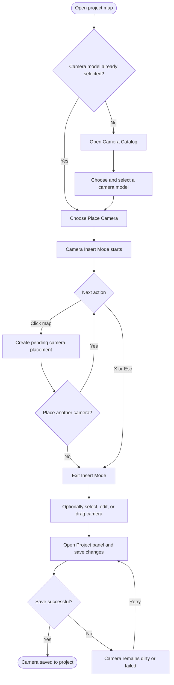

# User Flow: Placing a Camera on the Map

This diagram shows how a user selects a camera model, places cameras in the project workspace, adjusts a placement, and saves the changes to the project.

## Notes

- **Place Camera** is disabled until a camera model has been selected from the Camera Catalog.
- Each map click in Camera Insert Mode creates another local camera placement, so the user can place several cameras before leaving the mode.
- A newly placed or edited camera remains pending in the workspace until **Save changes** is used in the Project panel.
- Selecting a marker opens its camera panel. The user can edit its label, color, height, bearing, target values, or drag it to a different map position before saving.
