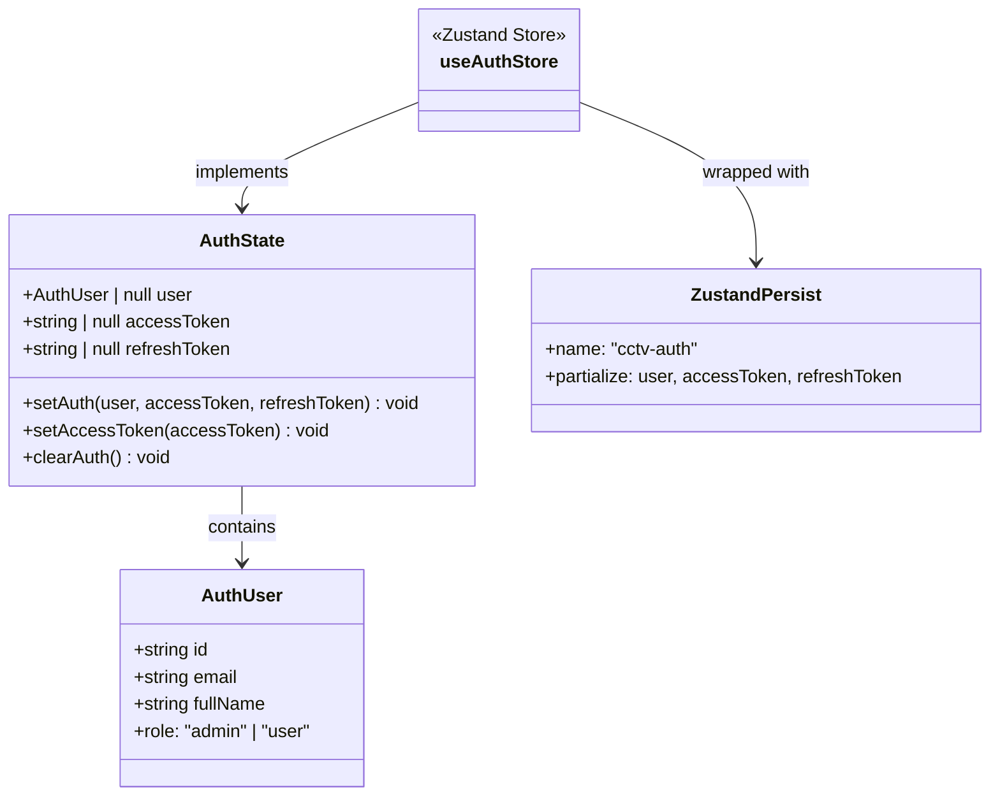
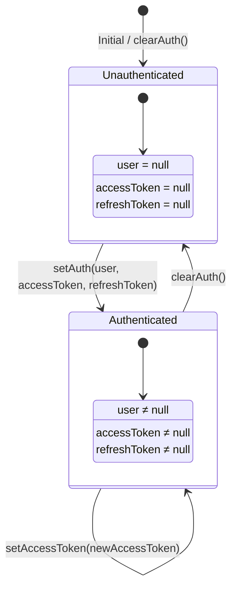

# authSlice.ts — Mermaid Diagram

## Store Architecture

```mermaid
classDiagram
    class AuthUser {
        +string id
        +string email
        +string fullName
        +role: "admin" | "user"
    }

    class AuthState {
        +AuthUser | null user
        +string | null accessToken
        +string | null refreshToken
        +setAuth(user, accessToken, refreshToken) void
        +setAccessToken(accessToken) void
        +clearAuth() void
    }

    class ZustandPersist {
        +name: "cctv-auth"
        +partialize: user, accessToken, refreshToken
    }

    class useAuthStore {
        <<Zustand Store>>
    }

    AuthState --> AuthUser : contains
    useAuthStore --> AuthState : implements
    useAuthStore --> ZustandPersist : wrapped with
```

## State Transitions

```mermaid
stateDiagram-v2
    [*] --> Unauthenticated : Initial / clearAuth()

    Unauthenticated --> Authenticated : setAuth(user, accessToken, refreshToken)

    Authenticated --> Authenticated : setAccessToken(newAccessToken)

    Authenticated --> Unauthenticated : clearAuth()

    state Authenticated {
        [*] --> HasUser
        HasUser : user ≠ null
        HasUser : accessToken ≠ null
        HasUser : refreshToken ≠ null
    }

    state Unauthenticated {
        [*] --> NoUser
        NoUser : user = null
        NoUser : accessToken = null
        NoUser : refreshToken = null
    }
```
